#  something (todo)

A tiny todo app built with React Native and Expo.

  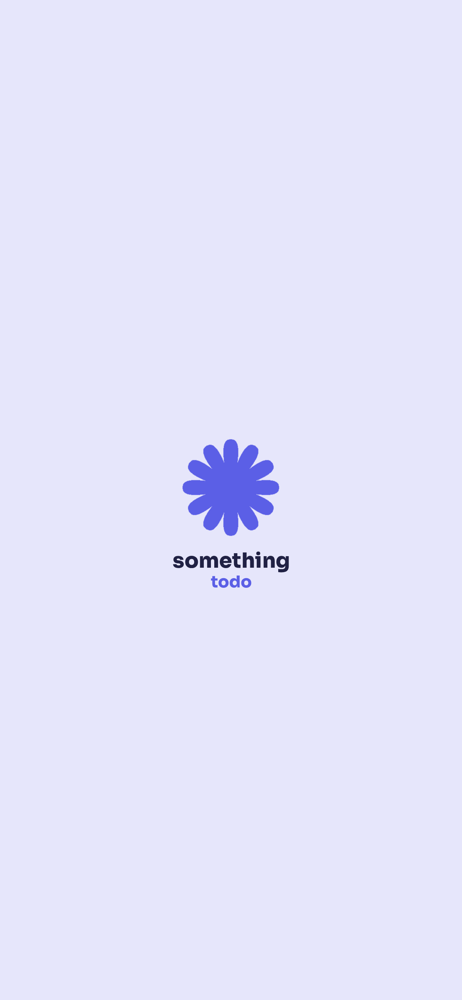
  &nbsp;&nbsp;&nbsp;&nbsp;
  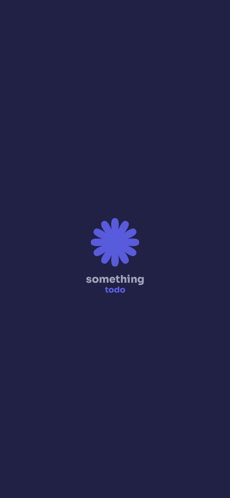

## Features

- Create and manage todos
- Set due dates and assign tags
- Mark todos as done and view completed items
- Cloud sync with Supabase (multi-device support)
- Multi-language support (EN, IT, DE, ES, FR)
- Dark mode support
- Smart notifications (daily briefing, due date reminders, overdue nudges)

## Screenshots

<table>
  <tr>
    <td align="center">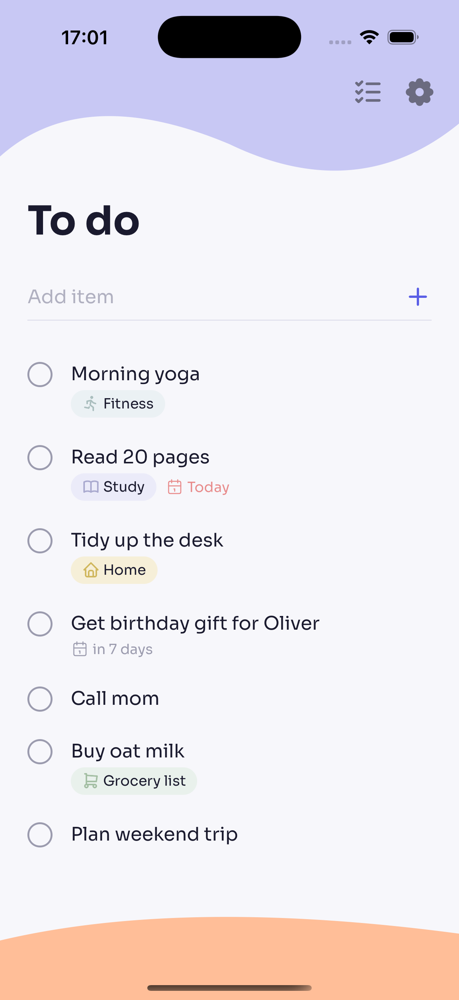</td>
    <td align="center">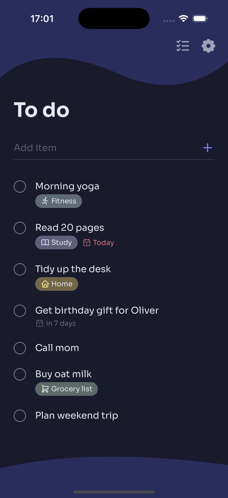</td>
  </tr>
  <tr>
    <td align="center">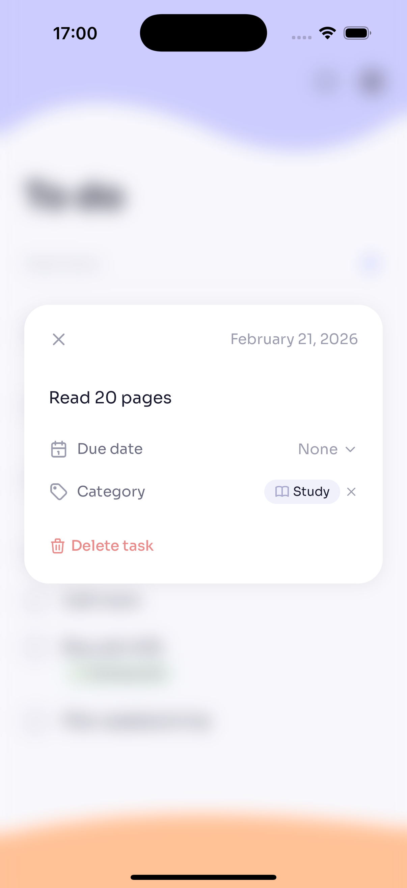</td>
    <td align="center">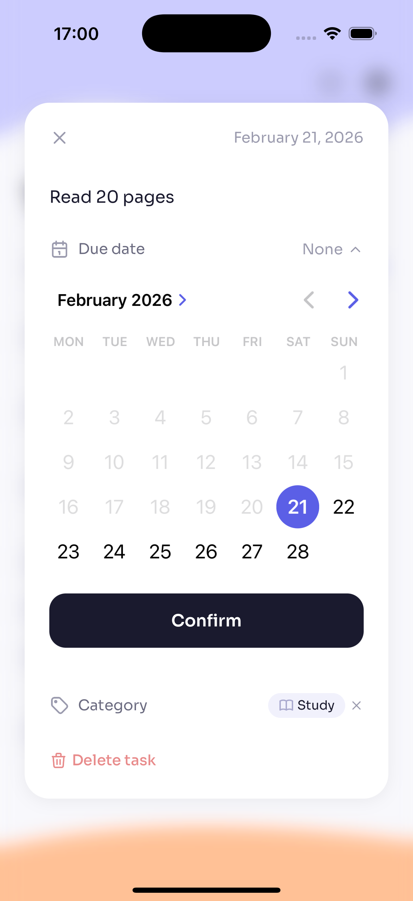</td>
  </tr>
  <tr>
    <td align="center">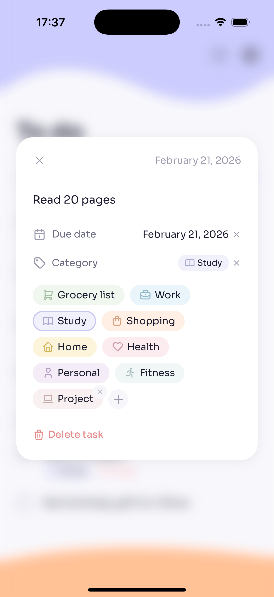</td>
    <td align="center">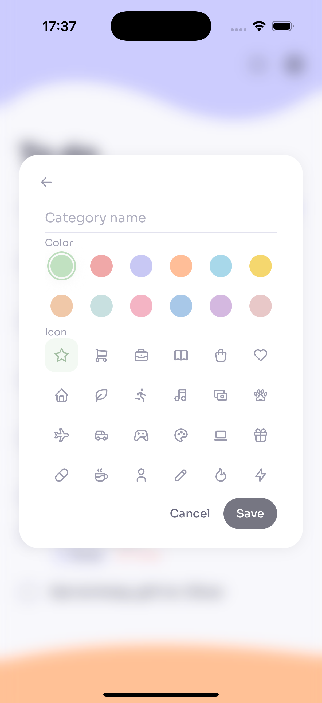</td>
  </tr>
  <tr>
    <td align="center">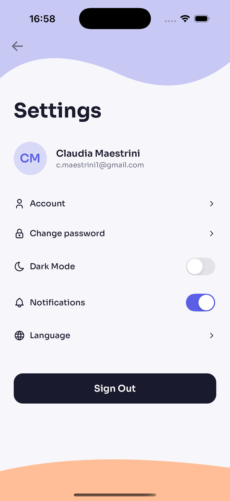</td>
    <td align="center">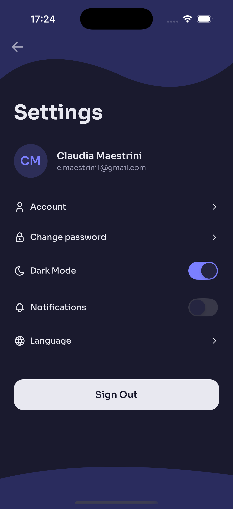</td>
  </tr>
  <tr>
    <td align="center">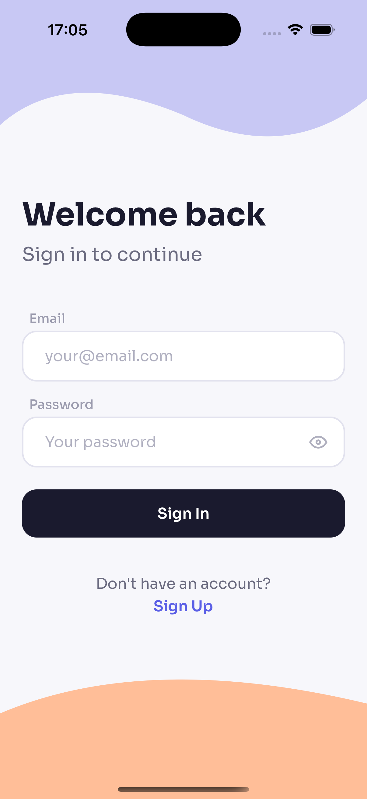</td>
    <td align="center"></td>
  </tr>
</table>

## Tech Stack

- React Native / Expo (Expo Router)
- TypeScript
- Supabase
- Zustand + AsyncStorage
- React Native Reanimated
- React Hook Form + Zod
- i18next
